# DQN-based-MARL-v2.0

## Overview
This work is related to my paper called 'Multi-Objective Workflow Scheduling With Deep-Q-Network-Based Multi-Agent Reinforcement Learning', which proposed a novel method for scientific workflow scheduling over heterogeneous virtual machines. Based on the algorithm framework, now i am attempting to utilize the pareto frontier technology combining with the two DQN agents for a bi-objective optimization workflow scheduling problem on heterogeneous containers.

This example uses the [Pegasus Scientific Workflows] (https://confluence.pegasus.isi.edu/display/pegasus/WorkflowGenerator) as the workflow templates and the [AWS Fargate Pricing] (https://aws.amazon.com/fargate/pricing/) as the resource model. 

## Requirements
Python 3.6.0+

## Usage
To run the program, please execute the following from the root directory: 

```
conda env create -f myDQN.yaml
```
or 
```
pip install -r requirements.txt
```

Once the environment is successfully installed, then go to run the **run_this.py** file

## Some results
### Time features
#### The distribution of runtime for each task type
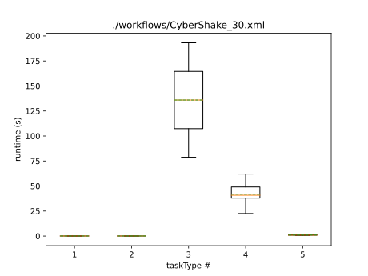
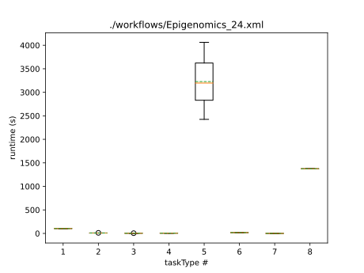
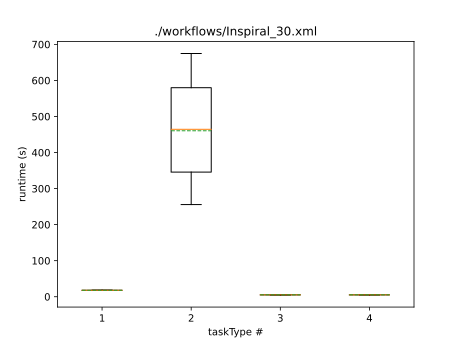
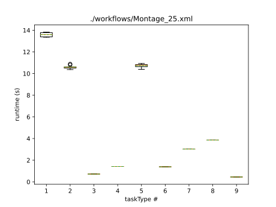
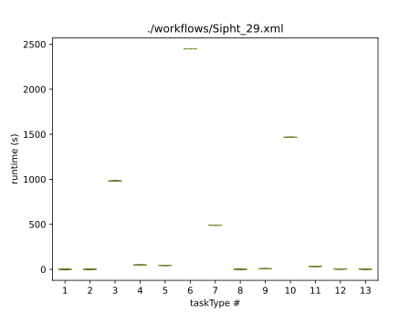

#### The distribution of transmission time for each task type
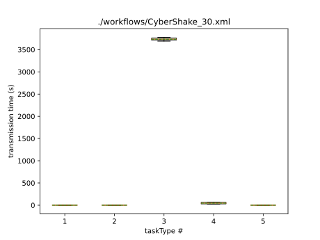
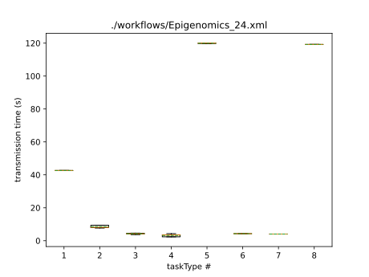
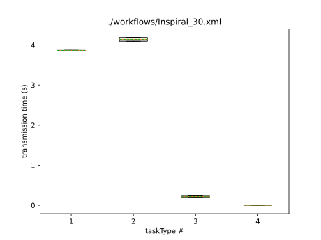
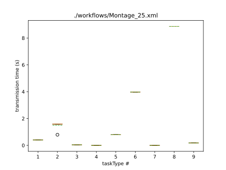
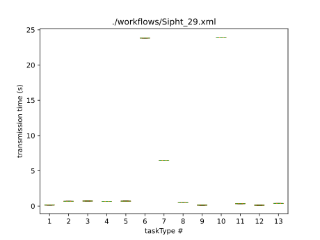

### Reward features
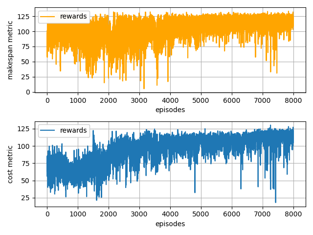

### Pareto frontier
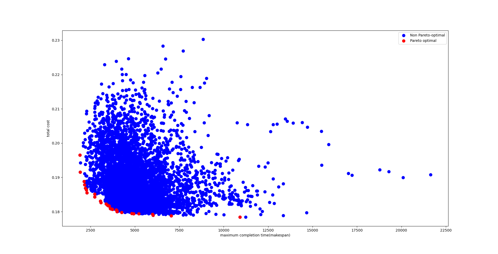

### Plans
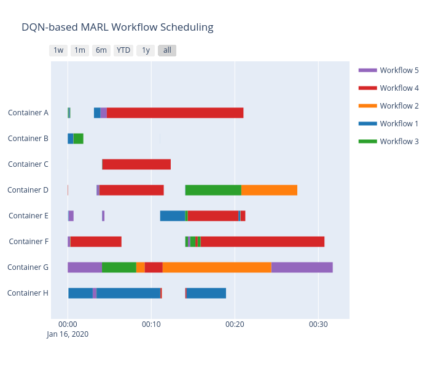
